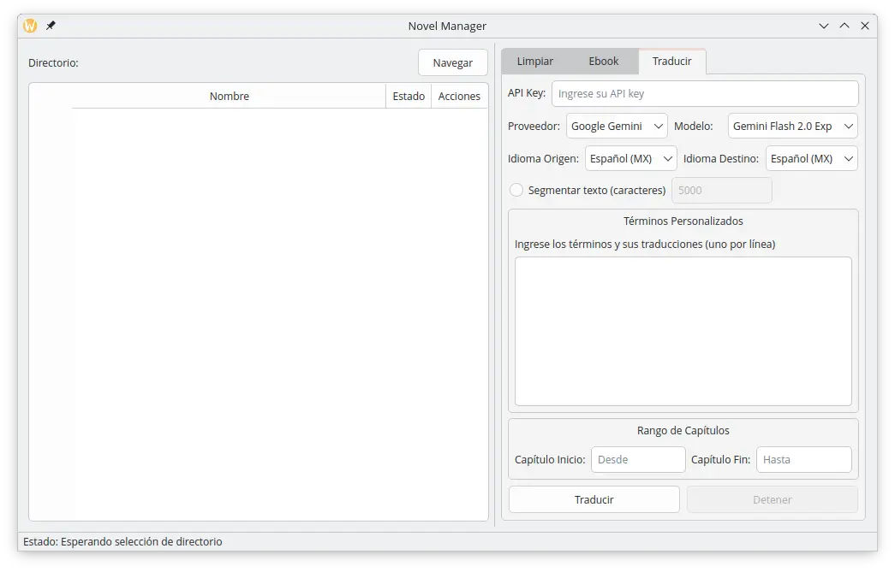
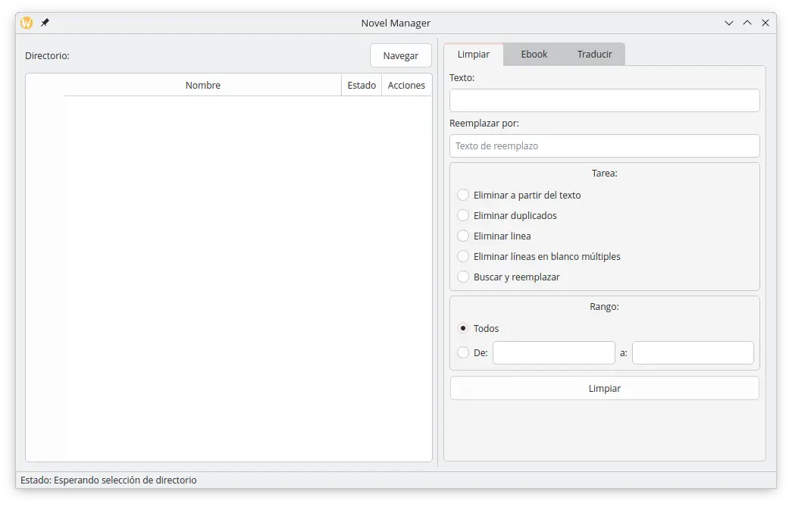
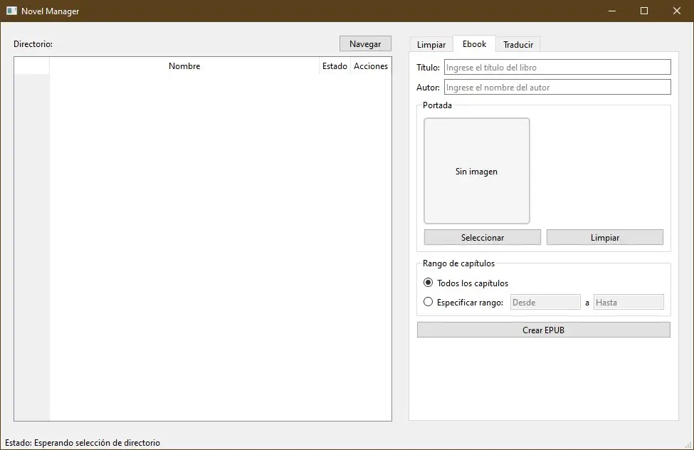

# Novel Manager

Una aplicación de escritorio para gestionar, procesar y traducir novelas y documentos de texto, con funcionalidades específicas para el manejo de capítulos y creación de ebooks.

## Características

### Gestión de Archivos
- Interfaz gráfica intuitiva para navegación y organización de archivos
- Vista previa y acceso rápido a documentos
- Soporte para archivos de texto (.txt)
- Sistema de seguimiento del estado de los archivos

### Traducción Automática


- Integración con APIs de traducción:
  - Google Gemini
  - Together AI
  - DeepInfra
- Soporte para múltiples idiomas:
  - Español
  - Inglés
  - Francés
  - Alemán
  - Italiano
- Funciones avanzadas:
  - Control de rango de capítulos
  - Sistema de pausas automáticas
  - Base de datos para registro de traducciones
  - Gestión de errores y recuperación

**Pestaña Traducir:** Permite traducir archivos de texto utilizando APIs de traducción.

*   **API Key:** Ingresa la clave de la API del proveedor de traducción que se utilizará.

*   **Proveedor:** Selecciona el proveedor de la API de traducción (ej: Google Gemini, Together AI).

*   **Modelo:** Elige el modelo de traducción específico del proveedor seleccionado.

*   **Idioma Origen:** Selecciona el idioma original del texto a traducir.

*   **Idioma Destino:** Define el idioma al que se traducirá el texto.

*   **Segmentar texto (caracteres):** Divide el texto en segmentos más pequeños para optimizar la traducción, especialmente para archivos grandes.

    *   **Caracteres por segmento:** Especifica la cantidad de caracteres por cada segmento.

*   **Términos Personalizados:** Introduce términos específicos con su traducción correspondiente para garantizar la coherencia y precisión en la traducción.

*   **Rango de Capítulos:** Define el rango de capítulos a traducir.

    *   **Capítulo Inicio:** El primer capítulo a traducir en el rango.
    *   **Capítulo Fin:** El último capítulo a traducir en el rango.

*   **Traducir:** Inicia el proceso de traducción.

*   **Detener:** Interrumpe el proceso de traducción en curso.

### Limpieza de Archivos


#### Modos de Limpieza

1. **Eliminar contenido después de texto específico**
   - Elimina todo el contenido del archivo a partir de un texto indicado
   - Útil para:
     - Remover anuncios o contenido promocional al final de capítulos
     - Eliminar notas de autor no deseadas
     - Quitar enlaces o referencias
   - Requiere:
     - Texto exacto desde donde comenzar la eliminación

2. **Eliminar duplicados**
   - Identifica y elimina secciones duplicadas de texto
   - Especialmente útil para:
     - Limpiar capítulos con contenido repetido
     - Eliminar resúmenes duplicados
     - Remover disclaimers repetidos
   - Requiere:
     - Texto que marca el inicio de la sección duplicada

3. **Eliminar línea específica**
   - Elimina líneas que comienzan con un texto determinado
   - Ideal para:
     - Remover líneas de formato específico
     - Eliminar marcadores o etiquetas
     - Limpiar líneas de metadata
   - Requiere:
     - Texto inicial de las líneas a eliminar

4. **Eliminar líneas en blanco múltiples**
   - Reduce múltiples líneas en blanco consecutivas a una sola
   - Utilizado para:
     - Mejorar el formato del texto
     - Normalizar el espaciado entre párrafos
     - Reducir el tamaño del archivo
   - No requiere parámetros adicionales

5. **Buscar y reemplazar texto**
   - Reemplaza todas las ocurrencias de un texto por otro
   - Aplicaciones:
     - Corregir errores tipográficos comunes
     - Unificar términos o nombres
     - Adaptar formatos de texto
   - Requiere:
     - Texto a buscar
     - Texto de reemplazo

#### Control de Rango
- Procesamiento selectivo por rango de capítulos
- Opciones:
  - Todos los capítulos
  - Rango específico (desde - hasta)

#### Características Adicionales
- Vista previa de cambios antes de aplicar
- Procesamiento por lotes de múltiples archivos
- Respaldo automático de archivos originales
- Sistema de recuperación en caso de errores
- Registro de operaciones realizadas

#### Requisitos del Sistema
- Permisos de escritura en el directorio
- Archivos en formato .txt
- Codificación UTF-8

#### Recomendaciones de Uso
1. Realizar respaldo de archivos antes de procesar
2. Verificar el texto de búsqueda/reemplazo
3. Usar rangos pequeños para pruebas iniciales
4. Revisar los archivos procesados
5. Mantener registro de cambios realizados

**Pestaña Limpiar:** Permite realizar tareas de limpieza y formateo en archivos de texto.

*   **Texto:** Introduce el texto específico requerido para la tarea de limpieza seleccionada. Este campo puede ser el texto a partir del cual se eliminará el contenido, el texto a buscar para eliminar líneas, o el texto a buscar y reemplazar.

*   **Reemplazar por:**  (Solo para "Buscar y reemplazar") Introduce el texto que sustituirá al texto buscado.

*   **Tarea:**

    *   **Eliminar a partir del texto:** Elimina todo el contenido del archivo desde el texto especificado.
    *   **Eliminar duplicados:** Elimina secciones duplicadas de texto, buscando el texto especificado como inicio del duplicado.
    *   **Eliminar línea:** Elimina líneas que comienzan con el texto especificado.
    *   **Eliminar líneas en blanco múltiples:** Reduce múltiples líneas en blanco consecutivas a una sola.
    *   **Buscar y reemplazar:** Reemplaza todas las instancias de un texto por otro.

*   **Rango:**

    *   **Todos:** Aplica la tarea de limpieza a todos los archivos en el directorio seleccionado.
    *   **De - a:** Aplica la tarea solo a un rango específico de archivos.

        *   **De:** El primer archivo a procesar.
        *   **a:** El último archivo a procesar.

*   **Limpiar:** Inicia el proceso de limpieza de los archivos.

### Creación de EPUB


- Conversión de archivos de texto a formato EPUB
- Personalización de metadatos
- Soporte para imágenes de portada
- Numeración automática de capítulos
- Estilos CSS predefinidos

**Pestaña Ebook:** Facilita la creación de archivos EPUB a partir de los archivos de texto.

*   **Título:** Introduce el título del libro que se reflejará en el archivo EPUB.
*   **Autor:** Introduce el nombre del autor del libro.
*   **Portada:**
    *   **Seleccionar:** Permite seleccionar una imagen para usar como portada del EPUB.
    *   **Limpiar:** Remueve la imagen de portada seleccionada, si la hubiera.
*   **Rango de Capítulos:** Especifica qué capítulos se incluirán en el EPUB.
    *   **Todos los capítulos:** Incluye todos los archivos de texto en el directorio en el EPUB.
    *   **Especificar rango:** Permite definir un rango específico de archivos a incluir.
        *   **Desde:** El primer capítulo a incluir en el EPUB.
        *   **Hasta:** El último capítulo a incluir en el EPUB.
*   **Crear EPUB:** Inicia el proceso de creación del archivo EPUB con las configuraciones especificadas.

## Requisitos

### Dependencias
```bash
PyQt6
ebooklib
requests
sqlite3
```

### Sistemas Operativos
- Windows
- Linux (KDE, GNOME)
- macOS

## Instalación

1. Clonar el repositorio:
```bash
git clone https://github.com/usuario/novel-manager.git
cd novel-manager
```

2. Crear entorno virtual:
```bash
python -m venv venv
source venv/bin/activate  # Linux/macOS
venv\Scripts\activate     # Windows
```

3. Instalar dependencias:
```bash
pip install -r requirements.txt
```

## Uso

### Iniciar la Aplicación
```bash
python main.py
```

### Flujo de Trabajo Básico

1. **Selección de Directorio**
   - Usar el botón "Navegar" para seleccionar la carpeta de trabajo
   - Los archivos .txt se cargarán automáticamente

2. **Limpieza de Archivos**
   - Seleccionar pestaña "Limpiar"
   - Elegir modo de limpieza
   - Especificar rango de capítulos (opcional)
   - Confirmar operación

3. **Traducción**
   - Seleccionar pestaña "Traducir"
   - Configurar API key y proveedor
   - Seleccionar idiomas de origen/destino
   - Iniciar traducción

4. **Creación de EPUB**
   - Seleccionar pestaña "Ebook"
   - Completar metadatos
   - Seleccionar imagen de portada (opcional)
   - Crear EPUB

## Estructura del Proyecto

```
novel-manager/
│
├── src/
│   ├── gui/
│   │   ├── clean.py
│   │   ├── create.py
│   │   └── translate.py
│   │
│   └── logic/
│       ├── cleaner.py
│       ├── creator.py
│       ├── database.py
│       ├── functions.py
│       ├── get_path.py
│       ├── loader.py
│       ├── translation_manager.py
│       └── translator.py
│
├── main.py
├── requirements.txt
└── README.md
```
